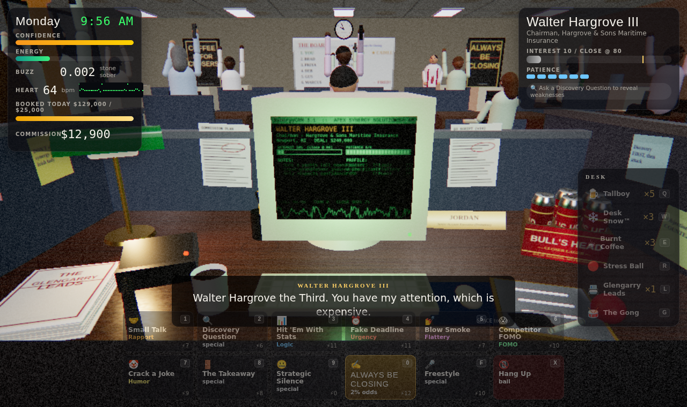

# COLD CALL: A Turn-Based Sales Tragedy

> *"Put. That coffee. Down. Coffee's for closers."*



A cold-calling simulator that runs in the browser, built with **three.js**. You're Jordan, a Senior Account Executive (Probation) at Apex Synergy Solutions. You have five business days, a rising quota, a phone, a six-pack of tallboys, a mirror with three lines of Desk Snow™, and a gong.

Every prospect has a real neural voice and reaches you through a band-limited telephone line. Your boss Chad yells from across the sales floor. Brad rings his gong to spite you.

```bash
npm install
npm run dev          # http://localhost:5173
```

Add `?low` to the URL on weak GPUs (turns off shadows, bloom and MSAA).

**Play online:** https://mitchazj.github.io/cold-call-simulator/ (deployed by `.github/workflows/pages.yml` on every push; enable it once under *Settings → Pages → Source: GitHub Actions*).

---

## How to play

Each call is a **turn-based battle**.

| | |
|---|---|
| **Interest** | The prospect's interest in buying. Get it past the gold line, then **ALWAYS BE CLOSING**. The close button shows your live odds. |
| **Patience** | Turns left before they hang up. Bad moves burn extra. |
| **Tactics** | 🤝 Rapport · 📊 Logic · ⏰ Urgency · 💅 Flattery · 😱 FOMO · 🤡 Humor. Every prospect is weak to some and resists others (resisted tactics *backfire*). |
| **Discovery Question** | Reveals the prospect's weaknesses on the CRM and highlights your best cards. |
| **Objections** | "Just send me an email." Each objection has a counter tactic. Counter it for a huge bonus; ignore it and everything you say is muffled. |
| **Strategic Silence** | Say nothing. Your next move hits ×2. Costs patience. |
| **The Takeaway** | "Maybe this isn't for you." Devastating on the stubborn rich, risky on everyone else. |
| **Freestyle** 🎤 | Type your own line. It's scored for tactics (numbers → Logic, "5pm" → Urgency, rivals → FOMO…), then spoken aloud by **Kokoro-82M running live in your browser**. Don't say "synergy" to the Irish lady. |

### The desk (one item per turn, or as many as you like between calls)

| Item | Effect |
|---|---|
| 🍺 **Tallboy** ×6/day | +Confidence. Buzzed (0.02–0.12 BAC): Rapport/Humor/Flattery ×1.25. Above 0.09 you *slur* (your lines are re-voiced drunk, and moves can misfire). Above 0.22 you black out on your keyboard. |
| ❄️ **Desk Snow™** ×3/day | +45 Energy, +Confidence, **+40 bpm**. Above 120 bpm you're **wired**: two actions per turn and Urgency ×1.35, but you talk too fast for Rapport. Above 190 bpm you meet the paramedics. 25% nosebleed chance. |
| ☕ **Burnt Coffee** ×4/day | +Energy, a little heart rate. |
| 🔴 **Stress Ball** | −22 bpm. 3-turn cooldown. |
| 📇 **Glengarry Leads** | The good leads. Your next dial is a whale. |
| 🥁 **The Gong** | Ring it after a close. Everyone cheers. Brad seethes. |

You can click the objects on the 3D desk directly: the phone dials, the six-pack cracks a beer, the mirror… you get it.

**Your body is part of the UI:** beer makes the camera sway, adds double vision and muffles the audio. Stimulants add chromatic aberration, a tunnel-vision pulse on every heartbeat, a thumping heartbeat in the mix, and a red vignette in the danger zone.

### The cast

Gerald the Tulsa plumber · Karen from Procurement · Tyler "T-Bone" Vance of BlockChainsaw Labs · Dr. Marjorie Ellsworth and her seven cats · Siobhan from Dublin (no synergy) · Denise the gatekeeper (close her to be *transferred*, with hold music) · Walter Hargrove III · Chip, who is always driving · Sal, who thinks you're a pizzeria · Mom (speed-dial #1) · and on Friday, **Victoria Sterling, CFO of OmniCorp Global. $2.4M. Three layers of objections.**

Miss quota twice and you're fired. Close Victoria for the real ending.

Keys: moves `1`–`0`, Freestyle `F`, Beer `Q`, Snow `W`, Coffee `E`, Ball `R`, Gong `G`, Leads `L`, Dial `D`, Hang up `X`, skip a line `Space`.

---

## Voices: open-source neural TTS

All 310 spoken lines are in [`src/data/script.js`](src/data/script.js). Every player line exists in three performances: **sober**, **drunk** (hand-slurred text, slowed down) and **wired** (fast). Lines carry performance tags (`<laugh>`, `<sigh>`, `<hiccup>`…) that expressive engines perform and simpler engines strip.

The repo ships with a pack baked by **Kokoro-82M**, so the game talks out of the box (`public/audio/voice`, 6 MB, 18 minutes of dialogue).

### Engines

| Engine | Year · License | Used for | Script |
|---|---|---|---|
| **Kokoro-82M** (hexgrad) | 2025 · Apache-2.0 | The shipped pack. Tiny, faster than real time on CPU, ~50 voices. | `tools/voice/bake_kokoro.py` |
| **Kokoro-82M via kokoro-js** | 2025 · Apache-2.0 | **Live, in the browser** (WebGPU or WASM): Freestyle lines, and "Live Kokoro" mode on the title screen. | `src/audio/voice.js` |
| **Qwen3-TTS VoiceDesign** (Alibaba Qwen) | 2026 · Apache-2.0 | **Designing voices from text prompts.** Each character has a `design` prompt ("Male, 60s, Oklahoma accent, gravelly…"). | `tools/voice/design_voices.py` |
| **Chatterbox** (Resemble AI) | 2025 · MIT | Emotion control (`exaggeration`) plus zero-shot cloning. Drunk and wired lines get pushed hard. `--turbo` for Chatterbox-Turbo. | `tools/voice/bake_chatterbox.py` |
| **Dia 1.6B** (Nari Labs) | 2025 · Apache-2.0 | Real nonverbals: `<laugh>` becomes an actual laugh. Great for prospects and Chad. | `tools/voice/bake_dia.py` |

Other open models that fit the same pipeline (write mp3s to `public/audio/voice/<line id>.mp3` and call `write_manifest`): Maya1 (voice design with emotion tags), IndexTTS2 (emotion and duration control), Higgs Audio v2, VibeVoice, Orpheus, and NeuTTS Air.

### Recipes

```bash
node tools/export-script.mjs                 # script.js → tools/voice/script.jsonl + cast.json

# 1. The shipped pack (CPU is fine)
pip install kokoro-onnx soundfile
curl -LO https://github.com/thewh1teagle/kokoro-onnx/releases/download/model-files-v1.0/kokoro-v1.0.int8.onnx
curl -LO https://github.com/thewh1teagle/kokoro-onnx/releases/download/model-files-v1.0/voices-v1.0.bin
python tools/voice/bake_kokoro.py --shard 0/3 & python tools/voice/bake_kokoro.py --shard 1/3 & python tools/voice/bake_kokoro.py --shard 2/3

# 2. The director's cut (GPU): design the cast from prompts, then perform with emotion
python tools/voice/design_voices.py           # → tools/voice/refs/<speaker>.wav from each `design` prompt
python tools/voice/bake_chatterbox.py         # clones those refs; exaggeration follows sober/drunk/wired
python tools/voice/bake_dia.py --only chad.,gerald.,marjorie.   # re-do the laughers with Dia
```

Every baker writes `public/audio/voice/manifest.json`. The game uses whatever is in it and fills gaps with live Kokoro or, failing that, the browser's speech synthesis. Re-bake a single character with `--only karen.`.

Changing the script: edit `src/data/script.js`, re-export, and bake with `--only` for the lines you touched. Ids look like `gerald.pos.1`, `player.close.0.drunk`, `chad.morning.2`.

## Sound effects

Every effect (phone bell, DTMF, ringback, the handset clack, a beer can cracking with carbonation fizz, three glugs and an *ahh*, the sniff, heartbeat, gong, crowd cheer, cash register, hold music, flatline…) is **synthesized live with WebAudio** in [`src/audio/engine.js`](src/audio/engine.js), so no assets are needed. Neural SFX override them when baked:

```bash
pip install stable-audio-tools einops soundfile
python tools/sfx/bake_sfx.py                                   # Stable Audio Open Small (2025), CPU-friendly
python tools/sfx/bake_sfx.py --engine tangoflux --only gong,cheer --variants 4   # TangoFlux (2025) on GPU
```

Prompts are in `SFX_PROMPTS` in the script ("Aluminum beer can cracked open, sharp pop and fizzing carbonation hiss, close up foley"…).

Mixing notes: prospects go through a 320 Hz–3.3 kHz telephone band with presence boost and soft clipping, plus line hiss while connected. Chad and the gong go through a convolution room reverb. You are close-mic'd and dry. Your BAC low-passes the whole mix.

## Code map

```
src/
  data/script.js      every line, prospect, objection, voice-casting prompt, SFX prompt
  data/lines.js       flattens the script into voice-line ids
  game/rules.js       pure game logic: stats, damage, objections, items, shop, days
  game/director.js    stages it all: dialing, the turn loop, events, endings
  scene/office.js     the procedural office: desk, props, coiled phone cord, coworkers, Chad, lights
  scene/person.js     primitive-built humans with procedural animation
  scene/crm.js        SynergyCRM 3.1 on the CRT, a live canvas texture
  scene/post.js       bloom + the "body" shader (drunk wobble, wired aberration, heartbeat pulse)
  scene/textures.js   every texture is painted in code: wood, carpet, posters, skyline, labels, a $100 bill
  audio/engine.js     buses, phone line, reverb, procedural SFX, heartbeat, ambience
  audio/voice.js      baked pack → live Kokoro → Web Speech → silence
  ui/hud.js           the DOM HUD
tools/
  export-script.mjs   script → JSONL for the bakers
  voice/*.py          Kokoro, Chatterbox, Dia, Qwen3-TTS VoiceDesign bakers
  sfx/bake_sfx.py     Stable Audio Open Small / TangoFlux
```

---

This is satire. Every person and company is fictional. Please don't do cocaine at work, or at all: your heart is not a KPI.
